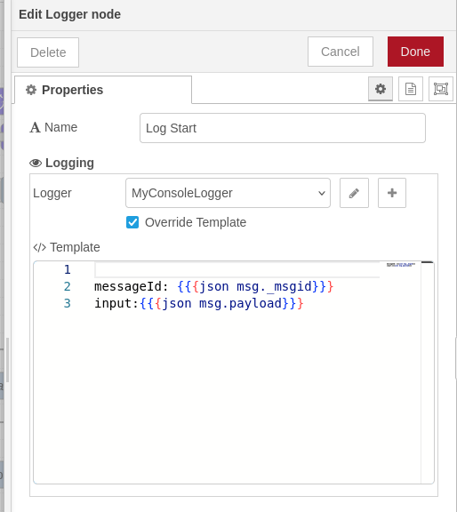
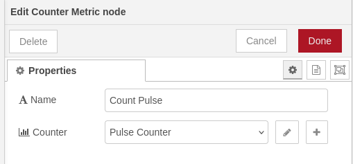
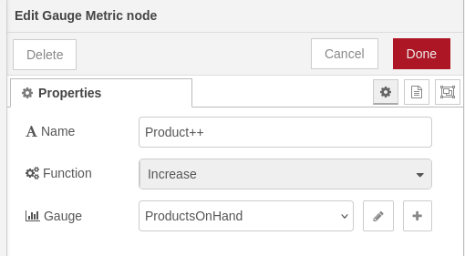
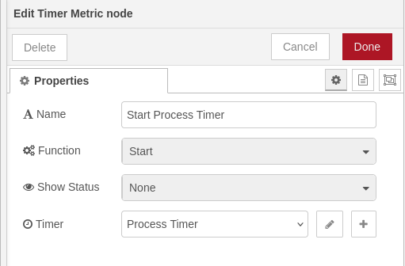
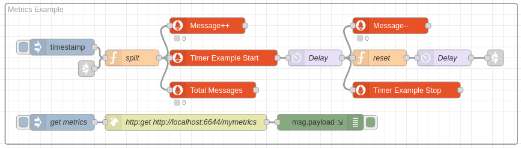
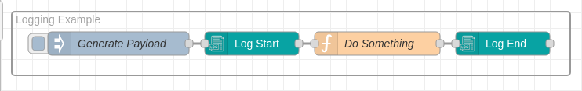

# @theotherwillembotha/node-red-telemetry

Node-RED nodes for structured logging and metrics. Built on [@theotherwillembotha/node-red-plugincore](https://github.com/theotherwillembotha/nodered_plugincore).

---

## Usage in Node-RED

### Installation

Either use the **Manage Palette** option in the Node-RED editor, or run the following command in your Node-RED user directory (typically `~/.node-red`):

```bash
npm install @theotherwillembotha/node-red-telemetry
```

> [!NOTE]
> This plugin is self-contained - `node-red-plugincore` is bundled inline and does **not** need to be installed separately.

### Nodes

#### Logging

##### Logger Node



Logs the incoming message to a configured logging backend and passes it through unchanged.

Select a logger config node (Console Logger, REST Logger, or Loki Logger) to control the destination. When **Override Template** is checked, the node uses its own Handlebars template instead of the one defined on the logger config node - useful when different Logger nodes in the same flow need different output formats.

#### Metrics

##### Counter Metric Node



Increments a counter by 1 each time a message is received. The current counter value is displayed on the node status. The message payload is not read - the counter is always incremented by 1.

##### Gauge Metric Node



Increases or decreases a gauge by 1 each time a message is received. The current gauge value is displayed on the node status.

**Function** controls the direction:
- **Increase** - increments the gauge by 1
- **Decrease** - decrements the gauge by 1

##### Timer Metric Node



Records timing observations to a histogram or summary. Three nodes are typically chained in a flow - one set to **Start**, one to **Stop** - to measure the duration of operations across multiple steps.

**Function** controls the operation performed on each message:
- **Start** - records the current timestamp (in milliseconds) into `msg._timer` and passes the message on.
- **Stop** - reads the timestamp stored by a preceding Start node, calculates the elapsed time in milliseconds, and records the observation. If no timestamp is found the message is still passed through with no observation recorded.
- **Observe** - reads a pre-calculated value from `msg._timer` and records it as an observation directly. Useful when the elapsed time is calculated externally.

**Show Status** controls what is displayed on the node in the flow canvas:
- **None** - no status is displayed.
- **Average** - displays the running average of all observations in milliseconds.

### Config nodes

These config nodes are shared across all plugins built on the framework.

| Config node | Provided by | Purpose |
|-------------|-------------|---------|
| Console Logger | [`node-red-logging`](https://github.com/theotherwillembotha/nodered_logging) | Writes log output to stdout |
| REST Logger | [`node-red-logging`](https://github.com/theotherwillembotha/nodered_logging) | Ships log entries to an HTTP endpoint |
| Loki Logger | [`node-red-loki`](https://github.com/theotherwillembotha/nodered_loki) | Ships log entries to Grafana Loki - install separately |
| Counter Metric | [`node-red-prometheus`](https://github.com/theotherwillembotha/nodered_prometheus) | Counter metric definition |
| Gauge Metric | [`node-red-prometheus`](https://github.com/theotherwillembotha/nodered_prometheus) | Gauge metric definition |
| Timer Metric | [`node-red-prometheus`](https://github.com/theotherwillembotha/nodered_prometheus) | Histogram / summary metric definition |

---

## Examples

### Metrics Example



A timestamp trigger feeds a message into three nodes simultaneously:

- **Metrics ++** - a gauge that increments on every message.
- **Total Messages** - a counter that increments on every message.
- **Timer Example Start** - a timer node that starts a timer and injects a reference into the message payload so it can be correlated later.

The message is then delayed by a few seconds before being handed off to two further nodes:

- **Metrics --** - the same gauge used by *Metrics ++*, this time decrementing it.
- **Timer Example Stop** - stops the timer that was started by *Timer Example Start* and records the observation.

The **Get Metrics** injection polls the metrics endpoint directly, retrieving the current state of all registered metrics.

Example scrape output:

```
# HELP counter_50f031bdf8f60f85 an example couter
# TYPE counter_50f031bdf8f60f85 counter
counter_50f031bdf8f60f85{flow="undefined",type="CounterMetricConfigNode",name="My Counter",id="50f031bdf8f60f85",metric="My Counter"} 6

# HELP summary_6a528fb7faa12ba3 an example timer
# TYPE summary_6a528fb7faa12ba3 summary
summary_6a528fb7faa12ba3{quantile="0.01",flow="undefined",type="TimerMetricConfigNode",name="Timer Example",id="6a528fb7faa12ba3",metric="Timer Example"} 1013.7
summary_6a528fb7faa12ba3{quantile="0.1",flow="undefined",type="TimerMetricConfigNode",name="Timer Example",id="6a528fb7faa12ba3",metric="Timer Example"} 1097
summary_6a528fb7faa12ba3{quantile="0.9",flow="undefined",type="TimerMetricConfigNode",name="Timer Example",id="6a528fb7faa12ba3",metric="Timer Example"} 2847
summary_6a528fb7faa12ba3{quantile="0.99",flow="undefined",type="TimerMetricConfigNode",name="Timer Example",id="6a528fb7faa12ba3",metric="Timer Example"} 2991.45
summary_6a528fb7faa12ba3_sum{flow="undefined",type="TimerMetricConfigNode",name="Timer Example",id="6a528fb7faa12ba3",metric="Timer Example"} 184628
summary_6a528fb7faa12ba3_count{flow="undefined",type="TimerMetricConfigNode",name="Timer Example",id="6a528fb7faa12ba3",metric="Timer Example"} 95

# HELP gauge_a90b1d118eeefaee an example gauge
# TYPE gauge_a90b1d118eeefaee gauge
gauge_a90b1d118eeefaee{flow="undefined",type="GaugeMetricConfigNode",name="Messages being processed",id="a90b1d118eeefaee",metric="Messages being processed"} 1
```

### Logger Example



A simple flow demonstrating structured logging across a processing step:

- An **Inject** node triggers the flow with the payload `"hello world"`.
- **Log Start** - a Logger node that logs the message id and payload at the start of the sequence.
- **Do Something** - a Function node that reverses the payload string.
- **Log End** - a Logger node that logs the message id and the transformed payload at the end of the sequence.

Both Logger nodes use a Console Logger config node with the following Handlebars template:

```
messageId: {{{json msg._msgid}}}
input:{{{json msg.payload}}}
```

> The `{{{json ...}}}` helper serializes the value as a JSON string. Triple braces are used to prevent HTML escaping.

Running the flow produces the following output on the console:

```
2026-09-11T21:39:18.057Z 9f05d23146d16f67 INFO {
  id: '9f05d23146d16f67',
  node: 'Log Start',
  type: 'LoggerNode',
  flow: 'Flow 1',
  instance: '172.21.0.2'
}
messageId: "fb46bfbabd46de37"
input:"hello world"

2026-09-11T21:39:18.058Z 0551864117ea9c90 INFO {
  id: '0551864117ea9c90',
  node: 'Log End',
  type: 'LoggerNode',
  flow: 'Flow 1',
  instance: '172.21.0.2'
}
messageId:"fb46bfbabd46de37"
output:"dlrow olleh"
```

Each log entry has a structured header - the ID and name of the Logger node that emitted it, its type, the flow it belongs to, and the Node-RED instance address. The instance field is particularly useful when a log aggregator (such as Loki) is collecting from multiple Node-RED instances.

---

## Repository

- Source: [github.com/theotherwillembotha/nodered_telemetry](https://github.com/theotherwillembotha/nodered_telemetry)
- Issues: [github.com/theotherwillembotha/nodered_telemetry/issues](https://github.com/theotherwillembotha/nodered_telemetry/issues)

## License

[ISC](LICENSE)
